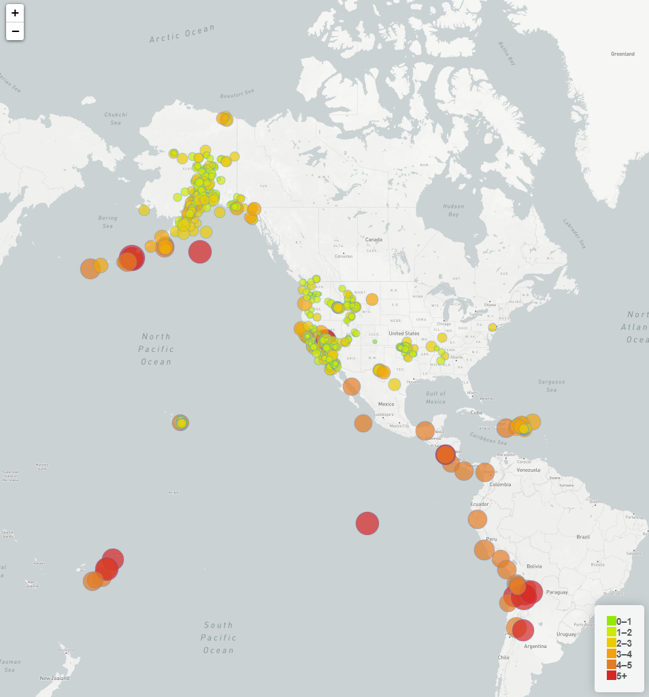

# Leaflet-challenge

### USGS 
 The given task as to visualize earthquake data for the United States Geological Survey(USGS). By selecting a set of data from their [website](http://earthquake.usgs.gov/earthquakes/feed/v1.0/geojson.php) and then plotting it using leaflet. 

 The below shows all earthquakes with a magnitude of over 1 for the last week.

### Visualization
- Created a map using leaflet that plots all earthquakes with a magnitude of over 1 for the last 7 days.
- Created markers that reflect the magnitude of the earthquake in their size and color
- If clicked the circle would show more data regarding the specific earthquake in question
- Also created a legend explaining the color of each circle and its meaning

